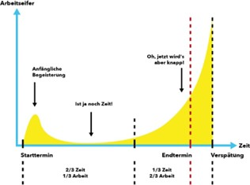

+++
title = "«Was du heute kannst besorgen, das verschiebe nicht auf morgen.» "
date = "2023-06-02"
draft = false
pinned = false
tags = ["Deutsch", "Reportage"]
image = "microsoftteams-image.jpg"
footnotes = "\\* Name von der Redaktion geändert"
+++


Prokrastination, extremes Aufschieben, eine Störung der Selbststeuerung. Was ist das genau und wie kommt es dazu? Diesen und noch weiteren Fragen sind wir auf den Grund gegangen. Psychologe Roger Schweizer sowie Justus* äussern Ihr Wissen zugunsten dieser Reportage und teilen ihre Erfahrungen.

Von **Dominique Boksberger und Amélie Scheidegger**



*„Den Garten vom Unkraut befreit, das Zimmer aufgeräumt und das Bett gemacht. Die Stunden gefüllt mit allem anderem als mit der Vorbereitung für die Maturitätsarbeit. Ausgeruht bin ich nicht, trotz der Freizeit, welche ich mir nehme. Mein Kopf ist bedrückt von schlechtem Gewissen und Stress. Meine Unterlagen für die Maturitätsarbeit liegen seit Monaten unberührt neben mir. Die Zeit drängt doch... Ach, egal, morgen bleibt ja auch noch Zeit“,* so erging es Justus während einer langen Zeit.

Solche Situationen erleben viele Menschen, welche aufgrund des Prokrastinierens unter Stress geraten, Arbeiten und Aufgaben noch rechtzeitig zu erledigen. Bei den meisten halten sich die Folgen des Prokrastinierens noch im Mass, doch andere leiden unter schwerwiegenden Folgen. Die Trennung der Freizeit und Arbeit gelingt nicht mehr und man fällt in einen Dauerstress. Prokrastination kann einen Menschen psychisch und physisch so auf die Probe stellen, dass man in Aufgaben versinkt, Fristen nicht länger einhalten kann und im schlimmsten Fall gekündigt wird. Diese Menschen leiden an chronischer Prokrastination und sollten sich Hilfe holen. Wie kann man aufhören, sich vor Arbeiten zu drücken und sich einen Ruck geben und endlich anzufangen? Wie kommt es zu diesem starken Aufschiebe-Problem und welche Menschen sind besonders davon betroffen?

## Wie ist der Alltag einer prokrastinierenden Person?

*Justus (19) ist ein Student der Universität Bern und studiert Pharmazie im zweiten Semester. In seinem Alltag erlebt er immer wieder Auswirkungen, die durch die Prokrastination erschienen sind.  Um die Lage der Personen, die prokrastinieren besser zu verstehen, haben wir ein Interview mit ihm geführt.* 

*„Schwer zu sagen, wann prokrastinieren bei mir das erste Mal aktiv auftrat. Die Motivation fürs Lernen war lange nie präsent“,* meinte Justus. Er schildert uns, dass er bereits in der Oberstufe gemerkt habe, dass er hin und wieder Hausaufgaben aufgeschoben oder, gar nicht erst gelöst hätte. Nach dem Übertritt ins Gymnasium stellte er schnell fest, dass er bei Fächern, welche ihn nur gering interessierten, abhängte. Da im Gymnasium viel mehr von ihm gefordert wurde als in der Oberstufe, sowie auch das Risiko bestand, in der Schule durchzufallen, sah er immer deutlicher, wie stark er vom Prokrastinieren betroffen war. Er fühlte sich immer wieder unter Druck gesetzt, da es ihm immer seltener gelang, Arbeiten zeitgerecht zu erledigen. Seinen Tiefpunkt erlitt Justus drei Wochen vor dem Abgabetermin seiner Maturaarbeit. Den praktischen Teil hatte er schon im Voraus erledigt, da dieser Teil ihm viel Spass bereitete. Doch der schriftliche Teil lies er auf sich warten, während der Abgabetermin immer näher rückte. Anstatt die Zeit zu nutzen, die ihm noch blieb, fing er an sein Zimmer aufzuräumen und seinen Tag mit Aktivitäten zu füllen, die er sonst als weniger wichtig erachtete. Mit den Schultern zuckend erwidert Justus: *„Ich wusste, dass die Zeit drängte und der Druck lastete immer stärker auf mir. Doch, was soll ich sagen, ich versuchte mir das schlechte Gewissen abzubauen, indem ich mich produktiv fühlte und andere Dinge erledigte.“* Bei ihm träten zwei verschiedene Stufen der Prokrastination auf, erklärte er uns. Bei der ersten Stufe sucht er sich ausreden und redet sich ein, dass er ja noch Zeit habe. Bei der zweiten sucht er ab einem gewissen Punkt Aufgaben zum Erledigen, um sich, einzureden er habe ja sowieso etwas anderes zu erledigen gehabt. Er konnte teilweise nicht mehr ruhig schlafen und fühlte sich nicht mehr ausgeruht. Dies lag womöglich daran, dass er die Arbeit von seiner Freizeit kaum mehr trennen konnte, da ihm die Gedanken quälten mit dem schriftlichen Teil der Maturarbeit anzufangen. Die Maturarbeit konnte er auf den letzten Drücker noch rechtzeitig abgeben, doch die Qualität litt deutlich, betonte Justus. Menschen welche Probleme mit dem Prokrastinieren haben, rät Justus, sich einen realistischen Zeitplan zu erstellen und Pausen einzuplanen, welche motivierend wirken. 

## Welche Auswirkungen bringt die Prokrastination mit sich?

*R. Schweizer ist Psychologe und arbeitet bei der Beratungsstelle der Berner Hochschule. Er ist schon vielen Menschen begegnet, die prokrastinieren. Wir haben mit ihm ein Interview geführt, um mehr über das Thema zu erfahren.* 

Wie stark jemand prokrastiniert, kann man an den Auswirkungen feststellen. R. Schweizers Antwort auf die Frage, wo die Grenze vom normalen Aufschieben und der starken Prokrastination zu ziehen wäre, lautet: *„Falls durch das Aufschieben psychische oder physische Konsequenzen auftreten, ist dies ein Unterschied zu Personen, die nur gelegentlich aufschieben.“* Er fügte hinzu, dass Personen, die stark prokrastinieren, das Schul- oder das Studienjahr abbrechen oder repetieren müssen, sich isolieren und an gesundheitlichen Problemen leiden. Das gelegentliche Aufschieben ist meistens punktuell. 

Wir fragen uns, welche Menschen von dem extremen Aufschieben betroffen sind. Die Antwort darauf ist sehr weitläufig. R. Schweizer arbeitet unter anderem mit Menschen verschiedener Altersgruppen zusammen, welche stark vom Prokrastinieren betroffen sind. Er stellt fest: *„Menschen, die zu Selbstzweifel neigen, kein Selbstvertrauen haben, chaotisch oder perfektionistisch sind, sind oft davon betroffen. Auch das Umfeld hat einen grossen Einfluss. Zum Beispiel muss man sich fragen, ob die Arbeit, die die Person ausübt, zu der Person passt oder umgekehrt. Zu viel Freiraum bei der Arbeit oder bei dem Studium kann einen demotivierenden Einfluss haben.“* Wenn man unmotiviert sei, könne sich dies auch negativ auf die Konzentration auswirken. Eine Konzentrationsschwäche sei sehr bekannt bei Prokrastinierenden, sagt er. 

Die Gründe, weshalb manche zu starker Prokrastination tendieren, sind sehr individuell. *„Schlechte Gefühle, Gefühle verdrängen, Selbsttäuschung, Mangel an Ehrlichkeit sich selbst gegenüber, Ziellosigkeit, fehlende Willensstärke, geringes Selbstvertrauen, zum Perfektionismus neigend, sind alles Gründe, die dafürsprechen“, informiert R. Schweizer. Man würde sich selbst etwas vormachen, erklärt er. „Ich habe dafür ja etwas anderes gemacht, also habe ich meine Zeit nicht verschwendet“*, ist die Aussage vieler betroffener Personen. Sie neigen dazu, alles im letzten Moment zu erledigen. *„Bei leichtem Aufschieben ist eine Therapie noch nicht nötig. Es ist wichtig, Schritt für Schritt zu arbeiten und sich darauf zu konzentrieren, was man gerade am Machen ist und das andere erst in einem nächsten Schritt zu erledigen. Man sollte sich auf Dinge konzentrieren, die relevant sind. Je schneller man sich jedoch Hilfe holt, desto mehr kann man die Auswirkungen verringern“*, berichtet R. Schweizer. 

## Ablauf einer Prokrastination

Quelle: [https://www.iconel.de/2021/02/01/aufgeschoben](https://www.iconel.de/2021/02/01/aufgeschoben-ist-jetzt-aufgehoben/)[\-](https://www.iconel.de/2021/02/01/aufgeschoben-ist-jetzt-aufgehoben/)[ist](https://www.iconel.de/2021/02/01/aufgeschoben-ist-jetzt-aufgehoben/)[\-](https://www.iconel.de/2021/02/01/aufgeschoben-ist-jetzt-aufgehoben/)[jetzt](https://www.iconel.de/2021/02/01/aufgeschoben-ist-jetzt-aufgehoben/)[\-](https://www.iconel.de/2021/02/01/aufgeschoben-ist-jetzt-aufgehoben/)[aufgehoben/](https://www.iconel.de/2021/02/01/aufgeschoben-ist-jetzt-aufgehoben/)

Laut der Webseite www.iconel.de ist die Prokrastination ein berufsbezogenes Phänomen. Die Website schreibt: *„Die Verkäuferin an der Supermarktkasse kann naturgemäss ihre Aufgaben nicht später machen. Es verläuft auch immer nach dem gleichen Muster, zunächst sind wir noch voller Euphorie, dann kommt „ach, es ist ja noch Zeit”, dann fangen wir vielleicht mal an und merken im letzten Drittel der Zeit, dass noch zwei Drittel der Arbeit zu erledigen ist und das jetzt knapp wird.“* (siehe Grafik 1) 

Die Grafik beschreibt, wie sich der Arbeitseifer im Laufe der Zeit entwickelt. Bei Justus sah es ähnlich aus, indem er sich einredete: *„Morgen bleibt ja auch noch Zeit”* und schliesslich in Stress geriet und schnellstmöglich noch ein Produkt fertigstellte, um es noch vor dem Abgabetermin auszuhändigen. Der Psychologe R. Schweizer gab einige Empfehlungen, wie man sich von der Prokrastination lösen kann. Einige kann man gut mit der Grafik vergleichen. *„Es ist wichtig, Schritt für Schritt zu arbeiten und sich darauf zu konzentrieren, was man gerade am Machen ist.“* Man sieht die erste Kurve (anfängliche Begeisterung) schnell in die y-Richtung zunimmt und anschliessen in etwa gleich schnell wieder abnimmt. Wenn man die jetzt aber Stufenweise vorgehen würde, gäbe es nicht so grosse Schwankungen der Kurve und man könnte den Abgabetermin stressfrei einhalten. Am Starttermin würde die Kurve zunehmen, danach wäre sie einigermassen konstant und anschliessend, falls man noch zu viel Zeit übrig habe und man mit dem Ergebnis zufrieden sei, würde sie wieder abnehmen. 

## Unsere Schlussfolgerung

Der grösste Teil der Menschen ist in gewisser Weise von Prokrastination betroffen, jedoch sind die Auswirkungen von Person zu Person unterschiedlich. Starke Prokrastination und führt Probleme mit sich. Es gibt verschiedene Methoden damit umzugehen und sie in den Griff zu bekommen, so dass man nicht unter physischen und psychischen Folgen leiden muss. Nachdem wir uns einige Wochen mit dem Thema auseinandergesetzt haben, sind wir zu dem Schluss gekommen, dass, falls man Änderungen des Lebens in Bezug auf die Prokrastination vornehmen will, es aus eigenem Antrieb machen muss. Man muss sich gezielt Ziele setzen und diese selbstbewusst umsetzen. Dies benötigt viel Selbstkontrolle, doch mit der nötigen Überzeugung kann dies gelingen. Wessen sein Interesse geweckt wurde rund ums Thema ‚Prokrastination‘, dem empfehlen wir das Buch: ‚Prokrastination – extremes Aufschieben‘ von Anna Höcker, Margarita Engberding und Fred Rist.